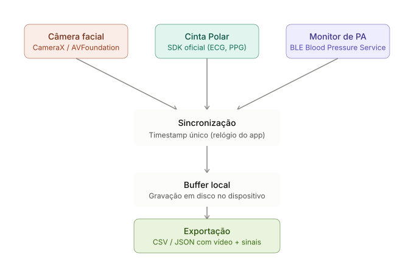

# Vault rPPG Collector

Open-source Flutter collector for synchronized **facial video** + **Polar H10** physiological ground truth (and operator-entered cuff blood pressure) for remote photoplethysmography (rPPG) research.

**This repository is software, not a dataset.** The app does **not** upload participant data to Primatio or any cloud by default. Whatever you record stays on the device until **you** export/share it.

Maintained by [Primatio](https://primat.io) · Copyright © 2026 Primatio / Felipe Andrade · Licensed under [Apache License 2.0](LICENSE)

---

## Ethics, privacy & sensitive health data (read before collecting)

The **code** of this project may be used under Apache-2.0. The **recordings** you produce with it (face video + biological signals + blood pressure) are **sensitive health / biometric data** and must **not** be treated with the same automatic openness as the source code.

Before publishing data, recruiting third parties, or running a study, you need at least:

1. **Informed consent** — a clear consent form covering video of the face, physiological signals, purpose, storage, sharing, and retention.
2. **Research ethics review** — in Brazil, evaluation by a **Comitê de Ética em Pesquisa (CEP)** when the work involves human participants, as required by **Resolução CNS 466/2012**.
3. **LGPD compliance** — facial biometrics are **sensitive personal data** under **LGPD art. 5º, II**. Processing requires a valid legal basis, purpose limitation, security measures, and (when applicable) DPIA / DPO oversight.

**Why face video is especially hard:** it is practically impossible to fully anonymize facial video without destroying the rPPG signal you need to preserve. Blurring, masking, or heavy downsampling typically removes the pulse information. Treat every session as **identifiable health data**, not as “open research dump.”

Primatio does **not** automatically collect, receive, or host your sessions through this app. Operators are solely responsible for lawful collection, storage, and any later sharing of datasets.

---

## Features

- Scan / connect to **Polar H10** over BLE
- Live **HR**, **RR-intervals**, and **ECG** (~130 Hz) when exposed by the device
- Front-camera preview with **ML Kit face detection** (face must stay visible for the full take)
- Fixed **30-second** synchronized recording (`video.mp4` + `polar_data.csv` + `metadata.json` + `face_tracking.json`)
- Operator-entered **cuff blood pressure** (SYS/DIA) **before** and **after** each take
- Local session library with review, export/share, and delete
- Optional offline scripts under `scripts/` for sync / BPM quality checks

## Requirements

- Flutter stable (3.38+ / Dart 3.10+)
- **Android 10+** (API 29) or **iOS 15.5+**
- Polar H10 (firmware **≥ 3.0.35** recommended for ECG)
- Physical device with BLE (simulators cannot exercise Polar)

## Getting started

```bash
flutter pub get
flutter run
```

### iOS

```bash
cd ios && pod install && cd ..
flutter run -d <ios-device>
```

Prefer `flutter run --profile` on iOS 26+ physical devices if debug hits intermittent Dart JIT `EXC_BAD_ACCESS (code=50)`.

### Android

Camera / Bluetooth permissions are declared in `android/app/src/main/AndroidManifest.xml` (`minSdk` 29).

## Typical collection flow

1. **Connect Polar** → scan → select H10 → wait until HR streams
2. **New Session** → Subject ID (+ optional notes)
3. Enter **start cuff BP** (SYS/DIA)
4. **Start 30s recording** → lock face in the oval (~0.6 s)
5. Keep the face visible for the full 30 s (leaving the frame discards the take)
6. Enter **end cuff BP** → session marked `complete`
7. Review → **Export / Share** only under your ethics / LGPD controls

## Architecture

Three signal sources feed a single sync epoch on device, then local disk, then optional operator-driven export:



| Source | Role in this app |
|--------|------------------|
| **Facial camera** | 30 s front video + live face gating (CamerAwesome + ML Kit) |
| **Polar strap** | BLE ground truth: HR / RR / ECG (official SDK wrapper) |
| **BP monitor** | Cuff SYS/DIA entered by the operator before and after the take (spot labels, VitalVideos-style — not a continuous arterial waveform) |

Inside the app, a shared **monotonic + UTC** timestamp anchors Polar CSV rows to the video start. Sessions are written under the app documents sandbox; export is explicit (`share_plus`).

| Layer | Choice |
|-------|--------|
| UI / state | Flutter + Riverpod |
| Camera | `camerawesome` (video + concurrent analysis) |
| Face detection | `google_mlkit_face_detection` |
| Polar BLE | `polar` |
| Storage | `path_provider` + per-session folders |

## Session folder layout

```
session_YYYYMMDD_HHMMSS_subjectID/
├── video.mp4
├── polar_data.csv
├── metadata.json      # includes blood_pressure.start / .end (schema v2)
└── face_tracking.json
```

Full schema: [`docs/DATA_FORMAT.md`](docs/DATA_FORMAT.md).

## Synchronization

At take start the app records wall-clock UTC and device monotonic milliseconds. Every Polar row uses `timestamp_ms` relative to that monotonic start. Expected MVP alignment is on the order of **50–100 ms**; refine offline with ECG/HR if needed (`scripts/validate_sync.py`).

## What is *not* open by default

| Artifact | Open? |
|----------|--------|
| Collector source code, docs, validation scripts | Yes (Apache-2.0) |
| Recorded face videos / Polar / BP sessions | **No** — sensitive health data; share only with consent + legal basis |
| Trained rPPG / BP models | Out of scope of this repo |

Do not commit real participant sessions into git. Sample folders under `scripts/sample_session*` are gitignored.

## Citing

If you use this software in academic work, please cite it. GitHub also exposes **Cite this repository** from [`CITATION.cff`](CITATION.cff).

```bibtex
@software{VaultRPPGCollector2026,
  author       = {Andrade, Felipe and Primatio},
  title        = {Vault rPPG Collector},
  year         = {2026},
  version      = {0.1.0},
  publisher    = {Zenodo},
  url          = {https://github.com/Primatio/vault-vital-trace},
  note         = {Replace with the Zenodo DOI once the archive is published}
}
```

[](https://doi.org/10.5281/zenodo.21895387)

## License

Copyright © 2026 **Primatio** and **Felipe Andrade**.

Licensed under the **Apache License, Version 2.0** — see [`LICENSE`](LICENSE) and [`NOTICE`](NOTICE).

You must retain copyright and attribution notices when you redistribute or modify this software. Third-party SDKs (Polar, ML Kit, etc.) remain under their own terms.
